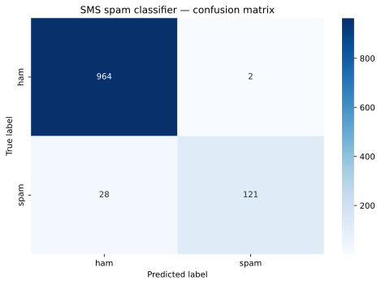

# SMS Spam Detection with Naive Bayes

A compact, reproducible text-classification project that identifies spam in English SMS messages. It demonstrates an end-to-end classical machine-learning workflow: text cleaning, TF-IDF feature extraction, stratified validation, model evaluation, and inference on new messages.

## Business problem

Unwanted messages consume attention and can expose users to fraud. This project establishes a transparent baseline classifier that can support message triage while keeping false positives visible through class-level metrics and a confusion matrix.

## Dataset

The repository uses the [SMS Spam Collection](https://archive.ics.uci.edu/dataset/228/sms+spam+collection) from the UCI Machine Learning Repository. The source dataset contains 5,574 labeled SMS messages and is licensed under CC BY 4.0. The CSV included here contains 5,572 usable records in the commonly distributed Kaggle-style format.

## Methodology

1. Normalize text to lowercase.
2. Remove URLs, punctuation, digits, and common English stop words.
3. Split the data into 80% training and 20% test samples with label stratification.
4. Fit TF-IDF features on the training data only (`max_features=3000`).
5. Train a Multinomial Naive Bayes classifier.
6. Evaluate accuracy, precision, recall, F1-score, and the confusion matrix on the untouched test set.

The fixed random seed (`42`) makes the reported split reproducible.

## Results

On the fixed 1,115-message test set, the model produced:

| Metric | Result |
|---|---:|
| Accuracy | 97.31% |
| Spam precision | 98.37% |
| Spam recall | 81.21% |
| Spam F1-score | 88.97% |

The confusion matrix contains 964 correct ham predictions, 121 correct spam predictions, 2 false positives, and 28 missed spam messages. The missed-spam count shows why the class-level report matters more than accuracy alone.



## Project structure

```text
Detector-de-Spam/
├── data/
│   ├── README.md
│   └── spam.csv
├── reports/
│   └── figures/
│       └── confusion-matrix.svg
├── src/
│   └── main.py
├── .gitignore
├── README.md
└── requirements.txt
```

## Run locally

```bash
python -m venv .venv
python -m pip install -r requirements.txt
python src/main.py
```

Activate the virtual environment before installing dependencies if your shell requires it.

## Limitations

- The messages are English-language SMS collected in a specific historical context.
- Regex normalization removes numbers and symbols that can carry useful spam signals.
- A single holdout split is useful for a baseline but does not replace repeated validation.
- Predicted probabilities are not calibrated for operational risk decisions.

## Next steps

- Compare logistic regression and linear SVM baselines.
- Add repeated stratified cross-validation.
- Tune the decision threshold for the cost of false positives versus false negatives.
- Package preprocessing and the estimator into one scikit-learn pipeline.
- Add tests for data loading and text normalization.

## Author

Tiago Sousa Leite

## Licensing

The dataset remains subject to its source's CC BY 4.0 license. No separate software license is granted for the project code and documentation.
